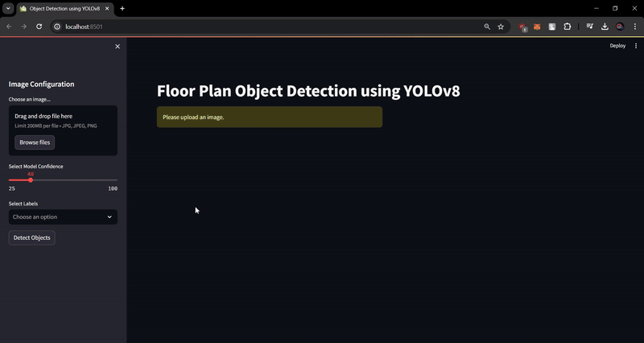

# Architectural Floor Plan Object Detection

## Overview

This project aims to develop an object detection system for architectural floor plans using the YOLOv8 model. The system was trained to detect various elements commonly found in floor plans, such as columns, walls, doors, windows, etc. Given an input image of a floor plan, the system will accurately identify and label these elements.

## Dataset

The dataset consisted of labeled images of architectural floor plans, categorized into classes such as 'Column', 'Wall', 'Door', etc. Each image is accompanied by its corresponding label file specifying the location and class of each object within the image.
(https://universe.roboflow.com/walldetect-f9eio/floor_plan_multiple)

## Technology Stack

- **YOLOv8**: Object detection model architecture
- **PyTorch**: Deep learning framework for model training and inference
- **YAML**: Configuration file format for dataset organization
- **torchvision**: Library for image transformations and dataset handling
- **Streamlit**: Web UI

## Use Cases

- **Architectural Design**: Architects and designers can use the system to automatically analyze floor plans and extract key elements for design optimization.
- **Construction Planning**: Construction companies can utilize the system for automated analysis of floor plans to streamline construction planning and resource allocation.
- **Real Estate**: Real estate agencies can leverage the system to quickly evaluate and classify properties based on floor plan features, aiding in property management and sales.

## Benefits

- **Efficiency**: Automated object detection reduces manual effort and time required for analyzing floor plans.
- **Accuracy**: The YOLOv8 model provides high accuracy in detecting and classifying architectural elements.
- **Scalability**: The system can be easily scaled to handle large datasets and real-time processing of floor plan images.

## Scope

### Development Phases:

1. **Data Preparation**: Collect and preprocess the dataset, including image resizing, labeling, and organization according to the YAML file structure.
2. **Model Training**: Train the YOLOv8 model using the prepared dataset to learn to detect architectural elements in floor plans.
3. **Evaluation and Optimization**: Evaluate the trained model's performance using validation data and fine-tune hyperparameters for optimal results.
4. **Integration**: Integrate the trained model into an application or service for real-world usage, providing an intuitive interface for users to upload floor plan images and receive object detection results.
5. **Deployment**: Deploy the application to a production environment, ensuring scalability, reliability, and performance.

## Web UI

This Streamlit web application allows users to upload images containing floor plans and perform object detection using the YOLOv8 model. Detected objects are displayed on the uploaded image along with their counts. Users can adjust the confidence threshold for object detection and export the detected objects and their counts to a CSV file.

## Getting Started

To run this application locally, follow these steps:

1. Clone this repository to your local machine.
2. Navigate to the project directory.
3. Install the required dependencies: `pip install -r requirements.txt`.
4. Run the Streamlit app: `streamlit run app.py`.
5. Access the application in your web browser.

## Usage

1. Upload an image containing a floor plan.
2. Adjust the confidence threshold using the slider in the sidebar.
3. Click the "Detect Objects" button to perform object detection.
4. Detected objects will be displayed on the uploaded image along with their counts.
5. Click the "Export to CSV" button to export the detected objects and their counts to a CSV file.

## Dependencies

- Streamlit
- Pillow
- Ultralytics

## Acknowledgements

- YOLOv8: [Ultralytics YOLO](https://github.com/ultralytics/yolov5)
- Streamlit: [Streamlit Documentation](https://docs.streamlit.io/)
- PIL: [Pillow Documentation](https://pillow.readthedocs.io/en/stable/)
